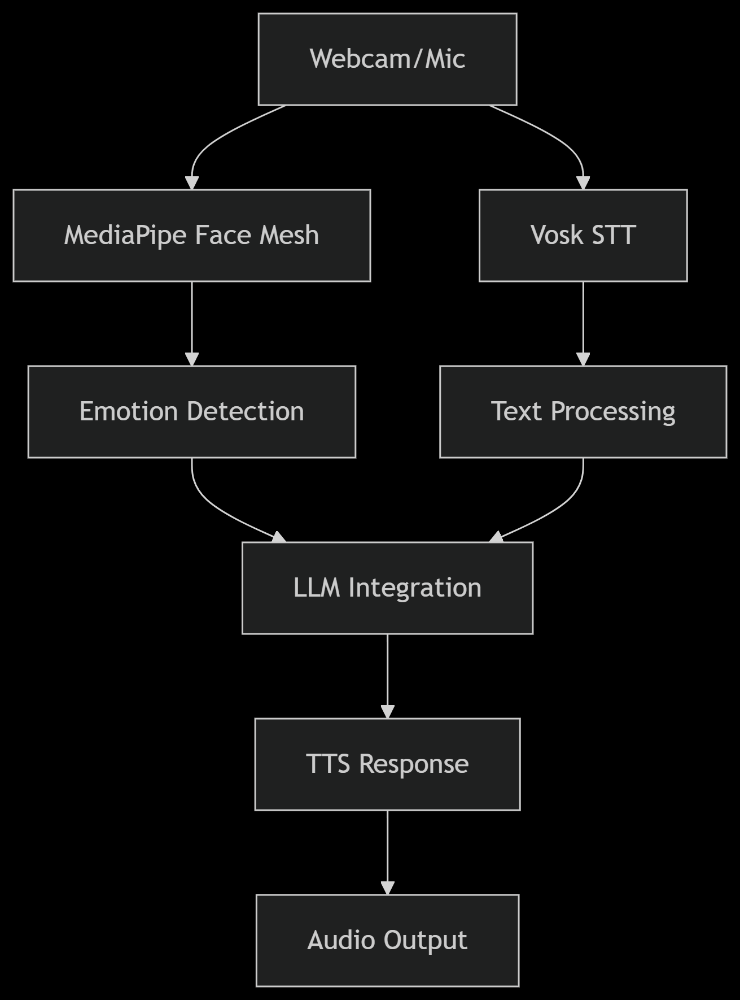

# SoulSync - Emotion-Aware AI Chat Application

*An AI companion that understands how you feel*

## Table of Contents
- [Features](#features)
- [Demo](#demo)
- [Installation](#installation)
- [Installation](#installation)
- [Usage](#usage)
- [Configuration](#configuration)
- [Supported Models](#supported-models)
- [Technical Stack](#technical-stack)
- [Development](#development)
- [Contributing](#contributing)
- [License](#license)
- [Contact](#contact)

## Features

✨ **Multimodal Emotion Detection**
- Real-time facial expression analysis via webcam
- Text sentiment analysis from chat input
- Combined emotion scoring for accurate understanding

🎙️ **Voice Integration**
- Speech-to-text transcription
- Natural text-to-speech responses
- Audio emotion tone detection

💡 **Intelligent Responses**
- Emotion-aware response generation
- Multiple LLM backend support
- Contextual conversation memory

🖥️ **Interactive Interface**
- Live face mesh visualization
- Adjustable AI parameters
- Clean, modern UI with Gradio

## Demo


[Watch Video Demo](https://youtu.be/demo-link) *(Replace with actual link)*

## Installation

### Prerequisites
- Python 3.8+
- GPU with CUDA support (recommended)
- Webcam microphone

### Steps
1. Clone the repository:
   ```bash
   git clone https://github.com/shivapreetham/SoulSync.git
   cd SoulSync
   ```

2. Install dependencies:
   ```bash
   pip install -r requirements.txt
   ```

3. Download models:
   ```bash
   # Vosk speech recognition model
   wget https://alphacephei.com/vosk/models/vosk-model-en-us-0.42-gigaspeech.zip
   unzip vosk-model-en-us-0.42-gigaspeech.zip -d models/
   
   # (Optional) Download additional LLM weights
   python download_models.py
   ```

## Usage
```bash
python main.py
```

### Interface Guide
- **Model Selection**: Choose from available LLMs in dropdown
- **Video Call**:
  - Click "Start Video Call" to enable webcam
  - Use "Start Recording" to begin emotion analysis
- **Chat**:
  - Type messages in the text box
  - View emotion analysis in real-time
- **Settings**:
  - Adjust temperature, top-k, top-p parameters
  - Modify max token length

## Configuration
Edit `config.ini` to customize:

```ini
[models]
default = microsoft/DialoGPT-large
cache_dir = ./model_cache

[audio]
sample_rate = 16000
channels = 1
voice = english

[interface]
theme = soft
width = 800
height = 600
```

## Supported Models

| Model Name        | Parameters | Best For               |
|-------------------|------------|------------------------|
| DialoGPT Large    | 355M       | General chat           |
| BlenderBot 3B     | 3B         | Longer conversations   |
| GPT-2 XL          | 1.5B       | Creative responses     |
| Custom Model      | Variable   | Specialized use cases  |

## Technical Stack

### Core Components
- **Natural Language**: HuggingFace Transformers
- **Computer Vision**: MediaPipe, OpenCV
- **Speech Processing**: Vosk, PyAudio, pyttsx3
- **Interface**: Gradio, Matplotlib

### Infrastructure


## Development

### File Structure
```
SoulSync/
├── main.py                # Main application
├── llm_utils.py           # Model loading/generation
├── chat_utils.py          # Conversation handling
├── emotion_detection.py   # Vision/audio analysis
├── config.ini             # Configuration
└── requirements.txt       # Dependencies
```

### Running Tests
```bash
python -m pytest tests/
```

## Contributing
We welcome contributions! Please see our [Contribution Guidelines](CONTRIBUTING.md) for details.

1. Fork the repository
2. Create your feature branch
3. Commit your changes
4. Push to the branch
5. Open a Pull Request

## License
MIT License - See [LICENSE.md](LICENSE.md) for details.
